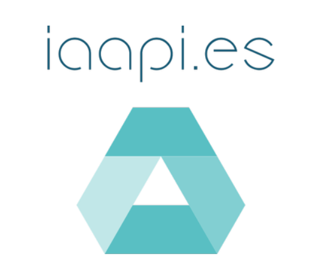

[](https://www.python.org/)

[](https://jaimesendraberenguer.com.com/)

[](https://GitHub.com/jaisenbe58r/iaapi/releases/)
[](https://GitHub.com/jaisenbe58r/iaapi/commit/)
[](https://ci.appveyor.com/project/jaisenbe58r/iaapi/branch/master)
[](https://www.codacy.com/gh/jaisenbe58r/iaapi/dashboard?utm_source=github.com&amp;utm_medium=referral&amp;utm_content=jaisenbe58r/iaapi&amp;utm_campaign=Badge_Grade)
[](https://codecov.io/gh/jaisenbe58r/iaapi)
[](https://github.com/jaisenbe58r/iaapi/blob/master/LICENSE)
[](https://GitHub.com/jaisenbe58r/iaapi/graphs/contributors/)
[](https://GitHub.com/jaisenbe58r/iaapi/issues/)
[](https://github.com/jaisenbe58r/iaapi/issues)


# iAApi
Proyecto base para la creación de una API basada en FastAPI. El proyecto es una adaptación del template proporcionado por ```nsidnev``` en su repositorio de Github: [GitHub | nsidnev](https://github.com/nsidnev/fastapi-realworld-example-app)

### Definición de la Arquitectura

Se ha optado por una arquitectura basada en microservicios a partir de un clúster de docker swarm. Dicho clúster esta desplegado sobre un servidor ``Ubuntu 20.04`` en una maquina virtual deDigital Ocean. Uno de estos microservicios será la API que actuará como punto de acceso a la aplicación desde el exterior.


Además se ha implementado un microservicio de base de datos ``postgres`` con su administrador ``pgadmin``, comunicada directamente con la API, con ello se crean la base de datos necesaria para gestionar todas las peticiones de la API sobre la db.

También se ha añadido el microservicio ```visualizer``` que nos permitirá monitorizar los microservicios en ejecución dentro del clúster.

A su vez, se integran también los microservicios de ``grafana`` y ``prometheus``, encargados de administrar y generar dashboards dinámicos para mostrar las métricas configuradas del clúster.

Con ello, estaremos desplegando en producción una API basada en microservicios de alta disponibilidad, capaz de hacer frente a un considerable volumen de peticiones HTTP de diferentes clientes. También se dota a esta arquitectura de una alta capacidad de escalamiento, puesto que el clúster de docker swarm nos permite hacer réplicas de cada microservicio en particular.

# Quickstart

## Instalación y configuración de Docker

En el siguiente [enlace](https://www.digitalocean.com/community/tutorials/how-to-install-and-use-docker-on-ubuntu-20-04-es) se explica también como instalar y usar Docker en ``Ubuntu 20.04``

A continuación se inicia y se hace un pequeño test para validar el correcto funcionamiento de ``Docker``:
```
# Start Docker service
sudo systemctl start docker

# Validate Docker version
docker --version

# Post installation configuration
# sudo groupadd docker
sudo usermod -aG docker $USER

# Download 'hello-world' docker image
docker pull hello-world

# Create a docker container from 'hello-world' image'
docker run hello-world

# List Docker objects
docker images #Images
docker ps -a  #Containers

#Stop Docker service
sudo systemctl stop docker
```


## Clonar Repositorio del proyecto

En primer lugar, clonamos el repositorio e instalamos todas las dependencias para crear y arrancar el entorno de trabajo, para ello utilizaremos ``poetry``:

```
git clone https://github.com/jaisenbe58r/iaapi
cd iaapi/
poetry install
poetry shell
```

## Crear entorno de trabajo

Posteriormente creamos el archivo ``.env`` y añadimos las siguientes variables de entorno:

```
export POSTGRES_DB=rwdb POSTGRES_PORT=5432 POSTGRES_USER=postgres POSTGRES_PASSWORD=postgres

touch .env

echo DB_CONNECTION=postgresql://$POSTGRES_USER:$POSTGRES_PASSWORD@$POSTGRES_HOST:$POSTGRES_PORT/$POSTGRES_DB >> .env
echo SECRET_KEY=$(openssl rand -hex 32) >> .env

echo PROJECT_NAME=<your proyect name> >> .env
```

Para ejecutar la aplicación en modo ``debug`` añade:
```
echo DEBUG=True >> .env
```

Para el administrador de base de datos ``pgadmin`` utilizariamos:

```
touch .env-pgadmin

echo PGADMIN_DEFAULT_EMAIL=<your email> >> .env-pgadmin
echo PGADMIN_DEFAULT_PASSWORD=<your email password> >> .env-pgadmin
```

## Creción del servicio FastAPI como microservicio

El servicio FastAPI se crea a partir de un contenedor docker y se desplega en el clúster de docker swarm dentro del entorno virtual de Producción. Este servicio es la API que recibe las peticiones ```HTTP``` de los clientes y se encarga de comunicarse directamente con los microservicios servidores del modelo para realizar las predicciones y posteriormente devolver el resultado al cliente.

En primer lugar se crea el archivo ``Dockerfile`` en la raiz del proyecto tal que así:

```Dockerfile
FROM python:3.8.1-slim

ENV PYTHONUNBUFFERED 1

EXPOSE 8000
WORKDIR /app


RUN apt-get update && \
    apt-get install -y --no-install-recommends netcat && \
    rm -rf /var/lib/apt/lists/* /tmp/* /var/tmp/*

COPY poetry.lock pyproject.toml ./
RUN pip install poetry==1.0.* && \
    poetry config virtualenvs.create false && \
    poetry install --no-dev

COPY docker/entrypoint.sh docker/entrypoint.sh

COPY . ./

RUN chmod +x ./docker/entrypoint.sh

CMD alembic upgrade head && \
    uvicorn --host=0.0.0.0 app.main:app
```

Para crear este servicio Fast API a partir del ``Dockerfile`` y subirlo a nuestra cuenta particular de ```Docker Hub``` procedemos de la siguiente manera:

```
docker build -t jaisenbe58r/iaapi:latest .
echo $DOCKER_PASSWORD | docker login -u $DOCKER_USER --password-stdin
docker push jaisenbe58r/iaapi:latest
```
A continuación os dejo un [enlace](https://avbravo-2.gitbook.io/docker/chapter1/registrarse-en-docker-hub) de cómo crear vuestra propia cuenta en ```Docker Hub```

## Despliegue de servicios con Docker swarm

Docker Swarm es una herramienta integrada en el ecosistema de Docker que permite la gestión de un cluster de servidores. Pone a nuestra disposición una API con la que podemos administrar las  tareas y asignación de recursos de cada contenedor dentro de cada una de las máquinas. Dicha API nos permite gestionar el cluster como si se tratase de una sola máquina Docker.

Para nuestro proyecto, se genera un clúster con docker swarm con 1 replica del microservicio de FastAPI ```jaisenbe58r/iaapi:latest``` creado en el apartado anterior, 1 base de datos postgress ``postgres:11.5-alpine``, 1 administrador de base de datos pgadmin ``dpage/pgadmin4``, 1 visualizador de contenedores docker en el clúster (```visualizer```), 1 microservicio de monitoreo de servicios (```prometheus```) y 1 microservicio de consulta y visualización (```grafana```):


```yml
version: '3'

services:
  app:
    image: jaisenbe58r/iaapi:latest
    ports:
      - 8000:8000
    env_file:
      - .env
    depends_on:
      - db
    command: ['./docker/entrypoint.sh', "db:5432"]
    deploy:
      replicas: 1

  db:
    image: postgres:11.5-alpine
    ports:
      - 5432:5432
    env_file:
      - .env
    volumes:
      - ./dbdata:/var/lib/postgresql/data:cached

  pgadmin:
    image: dpage/pgadmin4
    links:
      - db
    depends_on:
      - db
    env_file:
      - .env-pgadmin
    ports:
      - 5050:80

  visualizer:
    image: dockersamples/visualizer
    ports:
      - 9001:8080
    volumes:
      - /var/run/docker.sock:/var/run/docker.sock:ro
    deploy:
      placement:
        constraints: [node.role == manager]

  prometheus:
    image: prom/prometheus
    ports:
      - 9002:9090

  grafana:
    image: grafana/grafana:latest
    ports:
      - 9003:3000
    links:
      - prometheus:prometheus
    environment:
      - GF_USERS_ALLOW_SIGN_UP=false
```

Para poder desplegar el clúster de docker swarm vamos a ejecutar las siguientes lineas de comandos:

```
#Start docker service
sudo systemctl start docker

#Start Docker Swarm
docker swarm init

docker stack deploy -c compose-config-PROD.yml PROD-STACK

# Check services/containers
docker stack ls
docker service ls
docker container ls

#Visualize servicew on web browser (don't forget open port 9001)
http://<public IP>:8000/docs
```

## Chequear servivios activos

Una vez desplejado el clúster con todos los microservicios vamos a chequear que dichos servicios estén activos. Para ello vamos a ejecutar lo siguiente:

```cmd
docker stack ls
docker service ls
docker container ls
```

Para acceder al visualizador del clúster, basta con introducir en su navegador predeterminado la siguiente ruta:

http://```<public IP>```:9001/


Para eliminar el clúster de docker swarm ejecuta lo siguiente:

```cmd
# Remove stack
docker stack rm PROD-STACK

# Leave docker swarm
docker swarm leave --force

# Stop docker
sudo systemctl stop docker
```


## Monitorización

Como hemos comentado anteriormente, hemos desplegado el microservicio de grafana y prometheus que nos permiten almacenar y visualizar las metricas del cluster en funcionamiento que previamente configuremos.

Para acceder 

```
#### Monitoring ####

# Prometheus: IP:9002

# Grafana: IP:9003
# >> admin/admin

# Grafana Datasource:
# >> public-ip:9002
# >> server

# Grafana dashboards to import
https://grafana.com/grafana/dashboards?dataSource=prometheus

```

# Documentación de la API

La rutas de acceso a la documentación de la API son ``/docs`` or ``/redoc``, generadas con Swagger o ReDoc.


# Estructura del Proyecto


Los archivos relacionados con la aplicación estan en los directorios ``app`` o ``tests``:

```
app
├── api              - web related stuff.
│   ├── dependencies - dependencies for routes definition.
│   ├── errors       - definition of error handlers.
│   └── routes       - web routes.
├── core             - application configuration, startup events, logging.
├── db               - db related stuff.
│   ├── migrations   - manually written alembic migrations.
│   └── repositories - all crud stuff.
├── models           - pydantic models for this application.
│   ├── domain       - main models that are used almost everywhere.
│   └── schemas      - schemas for using in web routes.
├── resources        - strings that are used in web responses.
├── services         - logic that is not just crud related.
└── main.py          - FastAPI application creation and configuration.
```


# Tests

Los Test para este proyecto estan definidos en la carpeta ``test/``.

Este proyecto usa [pytest](https://docs.pytest.org/) para definir las pruebas puesto que nos permite usar el ``asset`` para las excepciones.

Para ejecutar todos los tests del proyecto, se ejecuta el comando ``pytest``:

```
$ pytest
================================================= test session starts ==================================================
platform linux -- Python 3.8.3, pytest-5.4.2, py-1.8.1, pluggy-0.13.1
rootdir: /home/some-user/user-projects/fastapi-realworld-example-app, inifile: setup.cfg, testpaths: tests
plugins: env-0.6.2, cov-2.9.0, asyncio-0.12.0
collected 90 items

tests/test_api/test_errors/test_422_error.py .                                                                   [  1%]
tests/test_api/test_errors/test_error.py .                                                                       [  2%]
tests/test_api/test_routes/test_articles.py .................................                                    [ 38%]
tests/test_api/test_routes/test_authentication.py ..                                                             [ 41%]
tests/test_api/test_routes/test_comments.py ....                                                                 [ 45%]
tests/test_api/test_routes/test_login.py ...                                                                     [ 48%]
tests/test_api/test_routes/test_profiles.py ............                                                         [ 62%]
tests/test_api/test_routes/test_registration.py ...                                                              [ 65%]
tests/test_api/test_routes/test_tags.py ..                                                                       [ 67%]
tests/test_api/test_routes/test_users.py ....................                                                    [ 90%]
tests/test_db/test_queries/test_tables.py ...                                                                    [ 93%]
tests/test_schemas/test_rw_model.py .                                                                            [ 94%]
tests/test_services/test_jwt.py .....                                                                            [100%]

============================================ 90 passed in 70.50s (0:01:10) =============================================
$
```

This project does not use your local ``PostgreSQL`` by default, but creates it in ``docker`` as a container (you can see it if you type ``docker ps`` when the tests are executed, the docker container for ``PostgreSQL`` should be launched with with a name like ``test-postgres-725b4bd4-04f5-4c59-9870-af747d3b182f``). But there are cases when you don't want to use ``docker`` for tests as a database provider (which takes an additional +- 5-10 seconds for its bootstrap before executing the tests), for example, in CI, or if you have problems with the ``docker`` driver or for any other reason. In this case, you can run the tests using your already running database with the following command:

Este proyecto no usa su `` PostgreSQL`` local por defecto, sino que lo crea en ``docker`` como un contenedor (puede verlo si escribe ``docker ps`` cuando se ejecutan las pruebas). Pero hay casos en los que no desea utilizar ``docker`` para las pruebas como proveedor de base de datos (lo que tarda +/- 5-10 segundos adicionales para su arranque antes de ejecutar las pruebas), puede ejecutar las pruebas utilizando su base de datos en local con el siguiente comando:
```
$USE_LOCAL_DB_FOR_TEST=True pytest
```

# CI/CD

En nuestro caso, hemos generado un ``Pipeline`` de Integración continua y despliegue continuo, tanto para el desarrollo como para el despliege de la aplicación en Producción.

Para la implementación de este ``workflow CI/CD`` utilizamos GitHub Actions. Esto nos permite automatizar, personalizar y ejecutar flujos de trabajo de desarrollo de software directamente en el repositorio del proyecto.

Tendremos 4 tipos de ``workflow``:
- **Styles:** Se desplegan los test de análisis de código estático con la herramienta ``Flake8``, con la que verificamos ``pep8, pyflakes and circular complexity``. Puede acceder a la documentación a partir del siguiente [enlace](https://buildmedia.readthedocs.org/media/pdf/flake8/latest/flake8.pdf).
- **Tests**: Corresponde a la automatización de todos los tests del proyecto, tal y como se ha comentado en el apartado anterior.
- **API spec:** Test de Integración del servicio de FastAPI. Se desplegan los test de integración implementados en el directorio ``./postman/``.
- **Deploy:** Despliegue de la Aplicación en un servidor externo (en nuestro caso ``DigitalOcean``).  Este ``workflow`` se encarga de construir la imagen docker de nuestra API y posteriormente, crear un clúster de docker swarm en el servidor para desplegar todos los microservicios comentados en el proyecto.

Este proyecto base o ``Template`` estàcontruido en base a la disposición de dos ``branch``, una para el desarrollo ``development`` y otra ``master`` para el despliegue en producción. Por tanto, este ``Pipeline`` de CI/CD permitirá realizar todos los test para cualquier ``push`` o ``pull_request`` de estas dos ``branch``. Pero en el caso de despliegue en producción ``Deploy``, sólo se ejecutaria a partir de un ``push`` del ``master``. Esto es muy básico y se podria mejorar, pero con esta solución, podemos trabajar haciendo CI/CD de manera simple y funcional.

